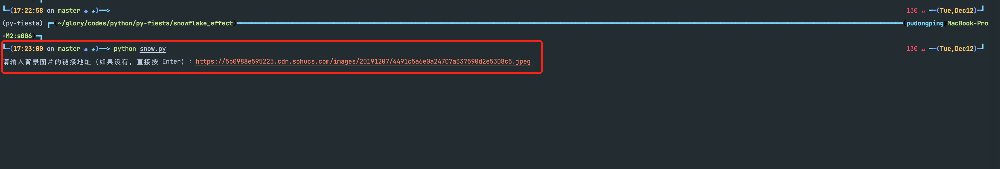
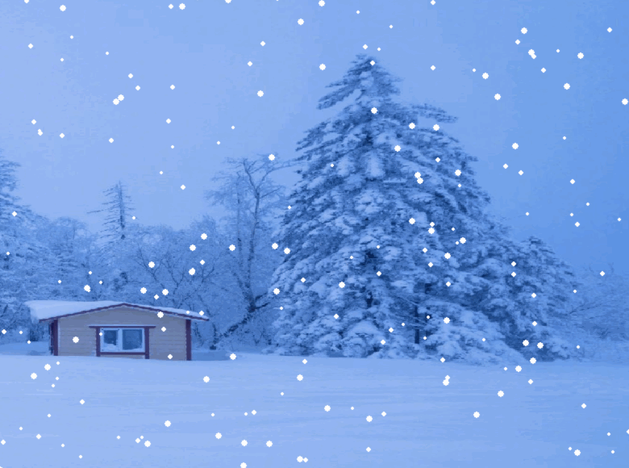

# 雪花效果

## 运行

```python
python3 snow.py
```



以下几张图作为背景，效果都还是可以的，你可以试试：

```
https://bpic.588ku.com/back_pic/04/52/50/67585fe156b43d7.jpg

https://ww4.sinaimg.cn/mw690/001LrePAly1hjr2ytjkmpj61fa1we7ie02.jpg

https://wx2.sinaimg.cn/mw690/001LrePAly1hjr2yv610ij61hb1z3tm902.jpg

https://img2.baidu.com/it/u=2869592630,307422322&fm=253&fmt=auto&app=120&f=JPEG?w=1280&h=800

https://pic.616pic.com/ys_bnew_img/00/12/79/jRyk5rTHHn.jpg

https://5b0988e595225.cdn.sohucs.com/images/20191207/4491c5a6e0a24707a337590d2e5308c5.jpeg
```

显示效果如下：

> 下面的图为 gif 动图，这里的图生成 gif 之后有压缩，画质可能不太好。



